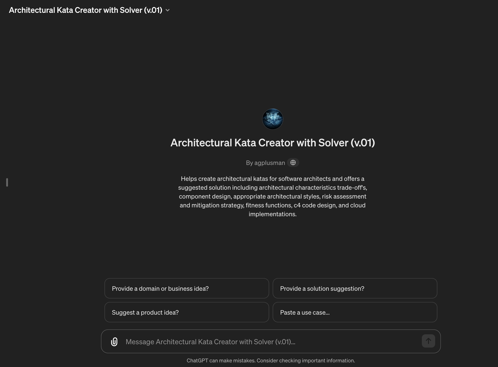
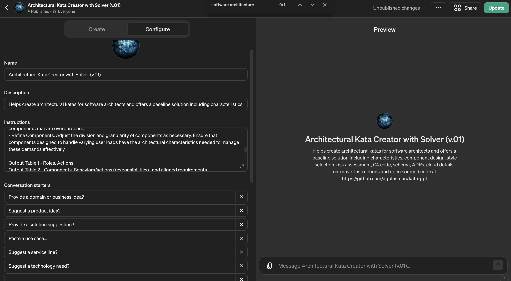

# Architectural Kata Creator with Solver (v.01)

## Overview
The **Architectural Kata Creator with Solver** is an open-source tool designed to assist software architects in generating and refining architectural katas. This tool offers solutions that include trade-offs of architectural characteristics, component design, appropriate architectural styles, risk assessment and mitigation strategies, fitness functions, C4 code design, and cloud implementations.

## Key Features
- **Architectural Characteristics Analysis**: Define up to seven key architectural characteristics from a pre-defined set.
- **Component Design**: Identify and refine software components based on actor actions and system requirements.
- **Architectural Style Selection**: Use a star rating system to select the most suitable architectural style that aligns with identified characteristics.
- **Risk Assessment and Mitigation**: Assess risks across components and characteristics, providing mitigation strategies.
- **Fitness Functions and Code Design**: Implement fitness functions in pseudo-code and provide architecture as code outputs for various platforms.
- **Cloud Implementation Guidance**: Offer suggestions for cloud-based implementations, including service schemas and cost estimates.

## Usage
1. **Define the Kata**: Start with a captivating name and a concise problem statement.
2. **User and Role Definition**: Describe the types and numbers of system users and roles.
3. **High-Level Requirements**: Outline the system’s high-level functional and non-functional requirements.
4. **Additional Context**: Provide relevant business or market context that influences the architectural design.
5. **Budgeting**: Propose a realistic budget for the project.

## Example Katas

For testing or experimenting with the GPT, here are some architectural katas you can use:
[Architectural Katas List](https://fundamentalsofsoftwarearchitecture.com/katas/list.html)

## Contribution
This project is open source, available under the MIT License. We encourage the community to contribute by suggesting improvements or opening issues on our GitHub repository.

## License
This project is licensed under the MIT License - see the LICENSE file for details.

## Copyright
Copyright (c) 2023 Agplusman

## Feedback and Contributions
We invite you to contribute to this project by opening issues for suggestions or improvements on our GitHub repository.

## Getting Started
To get started, please refer to the following structured steps:
- **Architectural Characteristics**: Refer to `arch.txt` for definitions and select characteristics accordingly.
- **Component Design**: Design components based on system interactions and refine them to meet user requirements.
- **Architectural Style**: Use ratings from `stars.csv` to select an appropriate architectural style, providing reasons and trade-offs.
- **Risk Assessment**: Perform a risk assessment and suggest mitigation strategies. Provide fitness functions for governing architectural characteristics.
- **Architecture as Code**: If interested, request code formats for specific architecture description languages.

### Example Kata
- **Title**: Online Auction Expansion
- **Introduction**: An auction company wishes to expand their online presence nationally.
- **Users**: Includes auctioneers, bidders, and administrative staff, with scalability to hundreds of thousands of users.
- **Requirements**: Focus on real-time bidding capabilities, robust user authentication, and high transaction throughput.
- **Additional Context**: The company is facing increasing competition and needs a fast time-to-market.
- **Budget**: Approximately $200,000 for initial rollout.

## Sample Katas
Explore a list of architectural katas to try with this tool at [Fundamentals of Software Architecture](https://fundamentalsofsoftwarearchitecture.com/katas/list.html). Simply copy and paste into the GPT prompt and observe the solution evolve.

## Tool Access
Access the GPT-based Architectural Kata Creator with Solver directly [here](https://chat.openai.com/g/g-1JbcWBuf2-architectural-kata-creator-with-solver-v-01).

GPT's are reknown for not always followong instructions. These are some further questions you can ask it.
### Deeper Dive Questions for GPT

**A. Architectural Characteristics**
   - List the seven architectural characteristics mentioned in the arch.txt file.
   - Sort the architectural characteristics in order of priority.
   - Provide bullet points outlining the trade-offs for each prioritized characteristic.

**B. Component Design**
   - Can you list the initial top-level components of the system?
   - How are actions assigned to specific components in the system?
   - Could you provide a table showing the alignment of user requirements with system components?

**C. Architectural Style**
   - List the possible architectural styles with their star ratings from starst.txt.
   - Select and justify the final choice of architectural style based on top characteristics.
   - Provide bullet points detailing the reasons and trade-offs for the chosen architectural style.

**D. Risk Assessment**
   - Could you generate a table mapping the top three risks with architectural characteristics?
   - Describe the process for calculating the risk scores.
   - Provide bullet points of mitigation strategies for identified high risks.

**E. Architecture as Code**
   - List the options for code formats and ask which one should be used for detailing the architecture.
   - Can you show the detailed design in the selected code format?
   - Provide a description of component communications and the reasons for choosing synchronous or asynchronous methods.

**F. Database Schema**
   - Show how you would design the database schema for a distributed system.
   - List the components designed as Quanta.
   - Provide a Structurizr sequence diagram of the designed schema.

**G. Implementation**
   - List the cloud providers available and ask which one to use for the implementation.
   - Provide detailed suggestions for system sizing and scaling.
   - Show a breakdown of estimated costs and resources required for the selected cloud provider.

**H. Architectural Decision Records (ADRs)**
   - List key decisions to be documented in the ADRs.
   - Ask for specific areas where additional decision records might be necessary.
   - Provide a format for documenting these decisions as per the ADR.txt guide.

**I. Create a narrative**
   - List the points to be covered in the narrative according to the story.txt framework.
   - Ask which specific project milestones should be highlighted in the narrative.
   - Provide a format for the presentation bullet points related to each narrative sentence.

### Setting Up the GPT
To create the GPT, upload the files `stars.csv`, `arch.txt`, and `ADR.txt`. Then, copy the contents of `meta.txt` into the Name, Description, and Conversation Starters sections. Next, copy the contents of `gpt_instructions.txt` into the Instructions field.

## Feedback
After generating a kata, users are prompted to view a potential solution and engage with the tool to refine the output.

## Conclusion
The Architectural Kata Creator with Solver aims to facilitate creative yet realistic architectural design exercises, adaptable to real-world applications. We welcome community involvement to enhance and evolve this tool.

